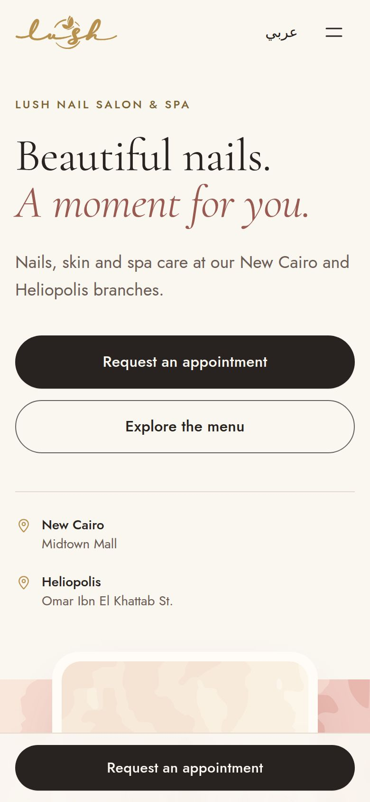
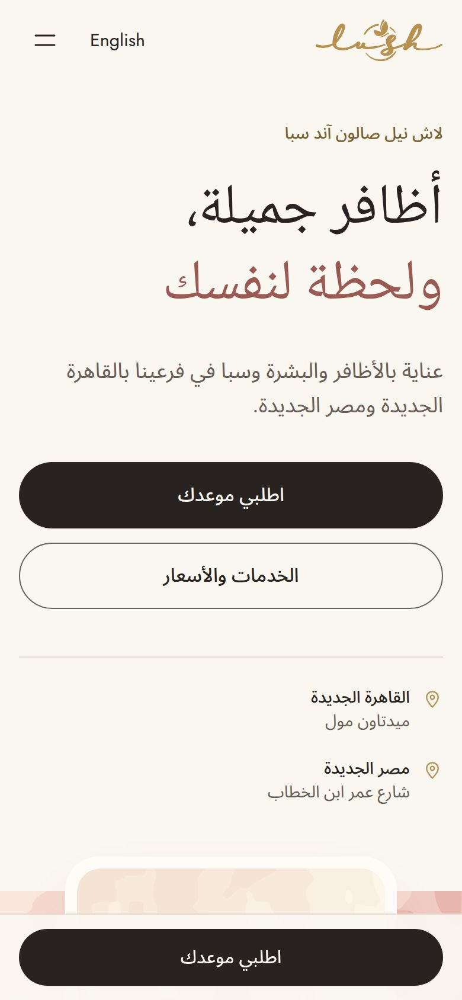
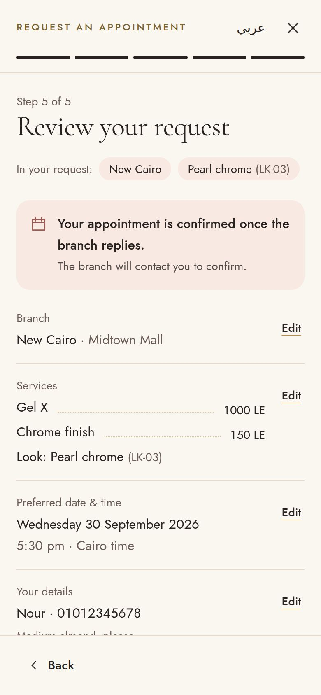

# Lush Nail Salon & Spa — website prototype

A bilingual (English / Egyptian Arabic) website for Lush Nail Salon & Spa, Cairo: service menu with real prices, an illustrated style gallery, bridal packages, branch details and a five-step appointment request flow.

This is a **private client presentation**. The page carries `noindex, nofollow` until the owner approves publication.


| Mobile | Arabic | Request flow |
| --- | --- | --- |
|  |  |  |

More previews are in [`docs/previews`](docs/previews).

## Run it

```bash
npm install
npm run dev        # http://localhost:5173  (add ?lang=ar for Arabic)
npm run build      # type-checks, then builds to dist/
npm run preview    # serves the production build
```

Stack: React 19, TypeScript, Tailwind CSS 4, Vite. Fonts are self-hosted (no third-party requests).

## Visual direction

**A considered moment of self-care, recognisably Lush.** The site is built from Lush's own material rather than generic spa styling:

1. **The Lush field.** The pink camouflage from the printed price list, traced into five vector layers (12 KB). It appears behind the hero, the bridal section and the style plates, softened where text sits on it.
2. **The real logo, used sparingly.** The gold script "lush" and its butterfly are vectorised from the price list artwork. Gold otherwise appears only in hairlines, menu leader dots and small labels, and it is never used for buttons.
3. **A typeset menu.** Service name, gold dotted leader, then price, as on a printed salon menu. Colour and add-on modifiers sit on an italic second line. Menu sections flow into balanced columns and never split.
4. **Editorial type.** Cormorant Garamond for display (with italic accents), Jost for interface and prices. Arabic uses Noto Naskh Arabic for headings and Noto Sans Arabic for text, with no faux italics and no letter-spacing.
5. **Charcoal for action.** Every primary action is a warm-charcoal pill. On phones, a persistent appointment bar sits in the safe area and the page reserves its height.

The palette follows the brief (ivory, blush, rose, champagne gold, charcoal, taupe), nudged toward the price list's warmer blush and peach. These are design choices, not official brand colour codes. Text colours were adjusted for WCAG AA contrast.

## Where to edit

| What | File |
| --- | --- |
| Branches, phones, map links, WhatsApp, Instagram, price-list link | `src/content/site.ts` |
| Services, prices, modifiers, durations, bridal packages and offer | `src/content/services.ts` |
| Gallery looks (names, styles, related services, optional photos) | `src/content/looks.ts` |
| Hero and bridal photography slots | `src/content/media.ts` |
| All interface copy, English and Arabic | `src/i18n/strings.ts` (Arabic is type-checked against English, so no key can be missing) |
| Colours, fonts, spacing tokens | `src/index.css` (`@theme`) |
| Booking-system connection point | `src/booking/provider.ts` |

## What works now

- Full homepage in English and Arabic with proper RTL mirroring. Switching language keeps every selection and any unfinished request.
- Menu with five category tabs (keyboard arrows supported, sticky while scrolling). Tapping a service adds it to the request.
- Gallery of nine looks with a viewer (arrow-key browsing). "Enquire about this look" carries the look reference (e.g. `LK-03`) and its menu service into the request.
- Appointment request: branch → services or "Help me choose" → preferred date and time → name and mobile → review.
  - Entry points pre-fill the request: a service row, a look, a branch in Locations, or a bridal package (bridal adds event date and group size).
  - Dates and times are interpreted in **Africa/Cairo** whatever the visitor's device zone. Past dates, past times today and dates more than 12 months ahead are rejected with friendly messages.
  - Egyptian mobiles in local or +20 format and international numbers are accepted, including Arabic-Indic digits.
  - The draft is kept for the browser session and between steps.
  - The review step says "Your appointment is confirmed once the branch replies." It offers **Copy request**, **Call {branch}** and **Message us on Instagram** (the request is copied first). Nothing on the site claims a request was sent or an appointment booked.
- Accessibility: native modal dialogs (focus trapped, Escape closes, focus returns to the trigger), visible focus states, labelled controls, 44 px touch targets, live-region announcements, reduced-motion support.
- Local business structured data for both branches (address, phone, map, Instagram). No ratings, hours or production domain.

## Needs connecting or confirming before launch

**Integrations (switched off until confirmed)**

- **WhatsApp:** set `whatsapp: { e164: '+20…' }` per branch in `site.ts` once the owner confirms which numbers use WhatsApp. The review step then offers a prefilled WhatsApp message. This path is built and tested.
- **Booking system:** implement `AppointmentProvider` in `src/booking/provider.ts`. The review step then shows "Send request" with loading, success (with reference) and failure states. None is connected today.
- **Payments:** none, by design. No payment methods are shown.

**Assets from Lush**

- **Photography.** The hero, spa and gallery images are original illustrations I drew as placeholders, not photos of Lush's work, premises or team. Replace them with Lush's own Instagram photos. Add files to `public/images/` and fill the slots in `media.ts` and `looks.ts`; the layout picks them up automatically. Suggested: 1 hero manicure close-up, 1 spa or Moroccan bath image, 1 bridal image, and 6–12 nail sets. About 1600 px on the long edge, WebP or AVIF.
- **Logo source file** (SVG or AI) to replace the traced version, if available.
- **Open Graph share image** (1200×630) for link previews.

**Business details to confirm**

- That prices are still current. The menu was transcribed from *Lush Price List.pdf* (last updated May 2026).
- That the bridal offer still applies: 10% off more than 3 services, 5% off for bridesmaids. It is shown as "As listed on the current price list".
- Opening hours, if they should appear. None are shown because none were published.
- Cancellation, deposit and payment policies. The FAQ currently directs visitors to the branch.
- Arabic service names. They were written for Cairo customers; the owner should review salon-specific terms such as ماسك الترمس (Termes body mask) and إكستنشن بريذابل.
- The production domain, once chosen. Then remove `noindex` in `index.html` and add canonical and `og:url` tags.

**Transcription notes.** Names follow the price list with light edits for clarity and consistency:

- "Cateye" → "Cat-eye"
- "extentions" → "extensions"
- "Whiten face mask" → "Whitening face mask"
- "Callus off removal" → "Callus removal"
- The bridal "full body wax or sweet" is written "wax or sugar", matching the menu's "Waxing\Sugar" heading.

Durations appear only for massage, the only section where the price list prints them.

## Research notes

The official service menu was read directly from the Google Drive PDF, and it is the source for every name, price, modifier, the logo and the camouflage pattern. Instagram and the Linktree page were not reachable from the build environment, so observations about them come from the brief. The branch map links are the ones given in the brief.

## Quality checks performed

Checked with headless Chromium against the production build:

- **Layout:** 390, 768 and 1440 px, English and Arabic, with no horizontal overflow at 390 px.
- **End-to-end request flow** (desktop and mobile): every validation message, Cairo-time logic with the browser set to Los Angeles, Arabic-Indic phone digits, copy to clipboard, and focus restoration after Escape.
- **Entry points:** look → request carry-over, branch preselection, bridal fields, and a language switch mid-flow that keeps all answers.
- **WhatsApp path:** temporarily enabled for one branch, to confirm the prefilled `wa.me` message and honest follow-up copy.
- **axe-core** (WCAG 2.1 A/AA and best practice): 0 violations on the page and in the dialog, in both languages. Text over the camouflage field was checked by hand, since automated tools can't measure it.
- **Links:** every outbound link goes to a verified destination (two phone numbers, two map links, Instagram, the price list). Every button has an accessible name, and there were no runtime errors, including with reduced motion.
- **Weight:** first load is about 232 KB in English and 308 KB in Arabic (fonts are split by script and loaded only when used).

Not tested: real iOS/Android devices and screen readers (VoiceOver, TalkBack), and live map, Instagram or WhatsApp destinations, which were unreachable from the build environment.
