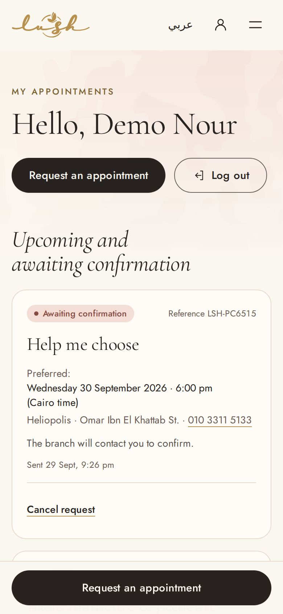
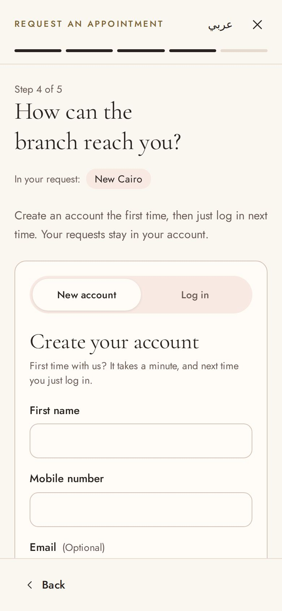
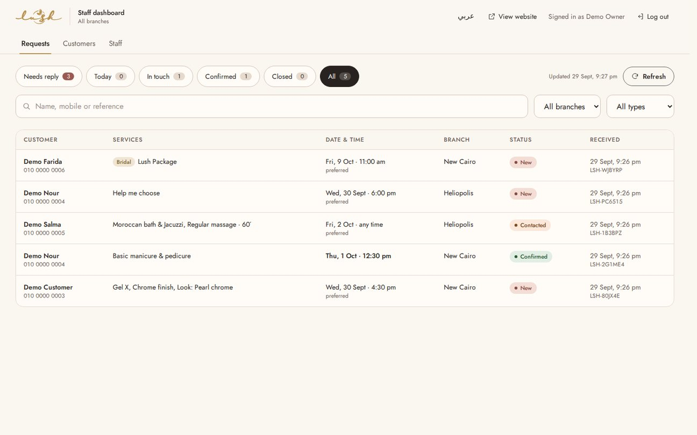
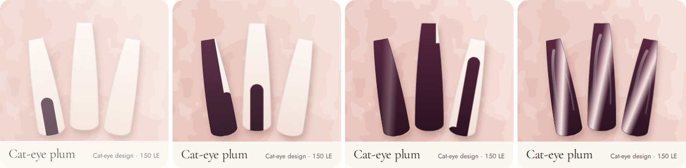

# Lush Nail Salon & Spa — website

A bilingual (English / Egyptian Arabic) website for Lush Nail Salon & Spa, Cairo. It has:

- a service menu with real prices;
- an illustrated style gallery and bridal packages;
- **customer accounts**: sign up the first time, then log in;
- a five-step appointment request flow that sends requests to the branch;
- a **staff dashboard** where branches confirm, decline and track every appointment and enquiry.

This is a **private client presentation**. The site sends `noindex, nofollow` until the owner approves publication. `/admin` is always `noindex`.


| Customer on mobile | Sign-up inside the request | Staff dashboard |
| --- | --- | --- |
|  |  |  |

More previews are in [`docs/previews`](docs/previews), including Arabic, the request drawer and the nail-painting frames (see [Motion](#motion)).

## Run it

Requires **Node.js 22.18 or newer** (24 LTS recommended). The database is SQLite through Node's built-in `node:sqlite`, so there's nothing else to install.

```bash
npm install
npm run seed:demo    # optional: fictional demo accounts and requests (development only)
npm run dev          # site on http://localhost:5173, API on :8787 (add ?lang=ar for Arabic)
```

Demo sign-ins created by `seed:demo`:

| Role | Mobile | Password |
| --- | --- | --- |
| Admin (all branches) | 010 0000 0001 | demo-admin-2026 |
| Staff (New Cairo only) | 010 0000 0002 | demo-staff-2026 |
| Customer | 010 0000 0003 | demo-customer-2026 |

Other commands:

```bash
npm run create-admin   # create the real owner/admin account (prompts for name, mobile, password)
npm test               # API tests: sign-up, log-in, permissions, branch scoping, status rules, resets, rate limits
npm run test:e2e       # build, then browser tests as a visitor, customer, staff member and admin
npm run test:e2e:dev   # the same against the Vite dev server, which also surfaces React warnings
npm run typecheck      # site and server
npm run build          # type-check, then build the site to dist/
npm start              # production: one Node process serves dist/ and /api
```

The browser tests use Playwright with Chromium. If Chromium isn't installed, run `npx playwright install chromium` once, or set `CHROMIUM_PATH` to an existing Chromium. Each run starts its own server on a fresh database, so it never touches `data/`.

Stack: React 19, TypeScript, Tailwind CSS 4, Vite (site); Hono on Node with SQLite (server). Fonts are self-hosted.

## How accounts and requests work

**Customers**
1. A customer browses the menu or gallery and taps "Request an appointment". Anything they picked (a service, a look, a branch, a bridal package) is carried in.
2. They choose a branch, services, and a preferred date and time. Dates follow Cairo time; past dates and times are rejected.
3. At "Your details", a first-time customer **creates an account without leaving the flow**: first name, mobile number, optional email, password. A returning customer **logs in** instead. Mobile numbers are matched in any format, including `+20…` and Arabic-Indic digits.
4. They review and press **Send request**. The request is saved with a reference such as `LSH-7K3Q9D`, and the customer sees it under **My appointments** as "Awaiting confirmation".
5. When the branch confirms, the customer sees "Confirmed" with the confirmed date, time and any message from the branch. The list refreshes when they come back to the tab.
6. Customers can cancel a request until its day has passed. A request whose day passed without a confirmation moves to *Past* and says so honestly.
7. Trying to sign up with a number that already has an account offers "Log in with this number".

**Staff and admins** (`/admin`)
- **Requests:** filter by *Needs reply*, *Today* (confirmed for today, in time order), *In touch*, *Confirmed*, *Closed* or *All*; search by name, mobile or reference; filter by branch and by type (appointment or bridal).
  - The list refreshes every 30 seconds, genuinely new arrivals are highlighted, and the browser tab shows the count waiting.
  - Opening a request shows the customer, with call and WhatsApp buttons, and the services with the menu prices at the time of the request. It also shows the preferred date and time, notes and history.
- **Actions:** mark as contacted; confirm (with date, time and an optional message to the customer; the date can't be in the past); change the confirmed time; decline; cancel; mark completed or no-show; reopen.
- **Internal notes** are visible to staff only.
- **Customers:** search, open a customer's requests from their card, and issue a **password reset code**. No email or SMS service is connected, so staff read the one-time code to the customer by phone or WhatsApp. It expires after 30 minutes.
- **Staff** (admins only): add staff, choose admin or staff, tie staff to one branch, disable accounts.
- **Roles:** *Admin* sees every branch and manages staff. *Staff* tied to a branch see only that branch's requests.

**If the server can't be reached** (for example, a static preview), the site switches automatically to the original mode. The visitor copies the request, calls the branch or messages on Instagram, and nothing claims to have been sent.

## Security

- Passwords are hashed with scrypt at OWASP's recommended cost. Staff accounts are never created by sign-up; admins create them.
- Sessions use random tokens, stored hashed. The cookie is httpOnly, SameSite=Lax, and `Secure` with a `__Host-` prefix in production. Sessions last 30 days for customers and 12 hours for staff.
- Changing or resetting a password signs out other devices, and disabling a staff member signs them out immediately.
- Writes are refused unless they come from the site itself (Origin check) and carry JSON.
- Pages carry a strict Content-Security-Policy (only the site's own scripts, with the one inline script pinned by hash), can't be framed, and are always revalidated so a deploy takes effect at once.
- Signing in replaces any session the browser already had.
- Rate limits apply to log-in, sign-up, reset codes and new requests.
- Every request is checked on the server. Customers only see their own requests, and staff only see their branch.
- Log-in errors don't reveal whether a number has an account.

## Where to edit

| What | File |
| --- | --- |
| Branches, phones, map links, WhatsApp, Instagram, price-list link | `src/content/site.ts` |
| Services, prices, modifiers, durations, bridal packages and offer | `src/content/services.ts` |
| Gallery looks (names, styles, related services, optional photos) | `src/content/looks.ts` |
| Hero and bridal photography slots | `src/content/media.ts` |
| Site copy, English and Arabic | `src/i18n/strings.ts` |
| Dashboard copy, English and Arabic | `src/admin/strings.ts` |
| Colours, fonts, motion | `src/index.css` |
| API, database, rules for status changes | `server/` (`app.ts`, `store.ts`, `db.ts`) |

The Arabic copy is type-checked against the English, so a missing translation fails the build.

## Deploying

The site now needs a small Node server, not static hosting. Any VPS or Node host with a **persistent disk** will do, for example Render, Railway or Fly.io with a volume, or a small VPS.

1. `npm ci && npm run build`, then `npm start`. Restart the process after every build, because it caches `index.html`.
2. Serve it over **HTTPS**; production cookies are `Secure`.
3. Set these environment variables:

   | Variable | Purpose |
   | --- | --- |
   | `PORT` | Port to listen on (default 8787) |
   | `DB_PATH` | Database file on the persistent disk (default `data/lush.db`) |
   | `APP_ORIGIN` | The public origin, e.g. `https://lushnailsalonspa.com` |
   | `TRUST_PROXY=1` | Set when behind a reverse proxy or load balancer |

4. Run `npm run create-admin` once on the server, then add the rest of the staff from `/admin`. **Do not run `seed:demo` in production** (it refuses to).
5. **Back up the database file daily.** It holds every account and request.

## Motion

Motion is choreographed rather than constant, and its signature comes from the salon itself: **every illustrated nail is painted the way a technician paints one.** It starts bare with a natural white tip. A stroke of polish goes down the centre, then one down each side, then tips, cat-eye light or hand-painted art go on, and finally a top-coat shine slides up the nail.




*Frames captured from the running site, slowed to a quarter of its speed.*

- **Hero on load:** the camouflage fades in, the headline reveals line by line, the framed plate rises with bare nails, and the set is painted nail by nail. With a mouse or trackpad, the camouflage layers drift apart slightly as the pointer moves.
- **Gallery:** each look waits with bare nails and is painted as it scrolls into view. On hover, tiles lift and the top coat catches the light.
- **Sections:** they rise into place the first time they scroll into view. The bridal section meets the page with soft camouflage-shaped edges.
- **Menu:** tabs switch with a sliding gold underline and the rows cascade in. A chosen service fills from its leading edge like a stroke of polish (from the right in Arabic), with a check that pops in.
- **Buttons:** the main buttons catch a top-coat shine on hover.
- **Request flow:** steps slide in the direction of travel, mirrored in Arabic, and the progress bar fills.
- **Dashboard:** new requests flash softly, and the detail drawer slides in from the side.

Motion uses `transform`, `opacity`, stroke drawing and clip paths only, and nothing hijacks scrolling. The operating system's reduced-motion setting turns all of it off, and the nails are then simply shown finished. The browser tests check that no nail or section is ever left bare or hidden, with motion on or off.

## Needs connecting or confirming before launch

**Integrations not connected**
- **Notifications:** new requests appear in the dashboard, but nobody is pinged. Adding SMS, WhatsApp Business or email alerts needs a provider account. The hook point is `insertRequest` in `server/store.ts`.
- **WhatsApp prefilled messages:** these are used only in the no-server fallback. Set `whatsapp: { e164: '+20…' }` per branch in `site.ts` once the numbers are confirmed.
- **Payments:** none, by design.

**Assets from Lush**
- **Photography:** the hero, spa and gallery images are illustrations I drew as placeholders, not photos of Lush's work. Replace them with Lush's own photos via `public/images/` and the slots in `media.ts` and `looks.ts`.
- The logo source file, if available, and an Open Graph share image (1200×630).

**Business and legal**
- **Privacy notice:** customer data (name, mobile, optional email, requests) is now stored. Add a privacy notice covering Egypt's Personal Data Protection Law (No. 151 of 2020) and link it from sign-up; the current consent line is a placeholder for that. Decide how long to keep old requests.
- Confirm that prices and the bridal offer (10% off more than 3 services, 5% for bridesmaids) are still current. They were transcribed from the May 2026 price list.
- Confirm opening hours (none are shown) and the cancellation, deposit and payment policies (the FAQ refers visitors to the branch).
- Arabic service names should be reviewed by the owner, e.g. ماسك الترمس and إكستنشن بريذابل.
- Choose the production domain, then remove `noindex` from `index.html`. `/admin` stays `noindex`.

**Transcription notes:** "Cateye" → "Cat-eye", "extentions" → "extensions", "Whiten" → "Whitening", "Callus off removal" → "Callus removal", and bridal "wax or sweet" → "wax or sugar", matching the menu's "Waxing\Sugar" heading. Durations are shown only for massage, as printed.

## Quality checks performed

Checked with headless Chromium against the production build and server.

- **Server tests (13):** sign-up and validation, the same number written different ways, generic log-in errors, cross-site write refusal, rate limiting, request validation (past dates, unknown services), customers isolated from each other, staff scoped to their branch and unable to file customer requests, confirmation rules (no past dates), no customer cancellation after the day, searches by reference never matching phone numbers, internal notes not leaking, single-use reset codes that revoke old sessions, a new sign-in replacing the old session, and admin self-lockout prevention.
- **Browser tests (50 scenarios across desktop 1440, mobile 390 and full motion: 147 runs, all passing)** in `e2e/`. Any console error or warning, failed request, request to another site, accessibility violation or horizontal overflow fails the test. The same suite also passes against the Vite dev server with no React development warnings.
  - *Visitor:* home page in both languages; navigation, deep links, menu tabs by mouse and keyboard, gallery viewer, FAQ, language memory, only verified outbound links, a real 404 page, and the security headers.
  - *Customer:* sign-up inside the flow, then log out and back in; validation on every step; carrying a look, branch or bridal package into the request; switching language mid-request; a double tap sending one request; a session ending before sending; Cairo dates from abroad; cancelling; profile, email, language and password changes; a reset code from the branch; an existing number offered log in.
  - *Staff and admin:* branch scoping; customers kept out; confirming, rescheduling, completing and declining, with the customer seeing each change; the Today view and search; customer reset codes and links to their requests; adding, moving and disabling staff without locking yourself out; staff asked to log out before requesting as a customer.
  - *Quality:* axe-core (WCAG 2.1 A/AA and best practice) on every request step, dialog, account page and dashboard screen in English and Arabic; sections never left hidden and nails never left bare, with or without motion; hero text readable within 1.5 s; the no-server fallback copying a request that names the branch and number.
  - *Edge cases:* 768 px tablet layouts; browser back and forward; very long names and notes; a booking made with the keyboard alone; a full Arabic booking typed with Arabic-Indic digits; closing the panel while a slow request is still sending; two staff acting on the same request; a staff member disabled mid-shift.
- **Lighthouse (production server, local):** desktop 100 performance, 100 accessibility, 100 best practices; mobile (simulated slow 4G) 95, 100, 100. SEO shows 63 only because of the intentional `noindex`.
- **Weight:** pages and scripts are served compressed (about 122 KB of script and 13 KB of CSS gzipped); the dashboard is a separate download that customers never load.

Not tested: real phones and screen readers, hosting on a real domain with HTTPS, and load beyond a single salon's traffic.
